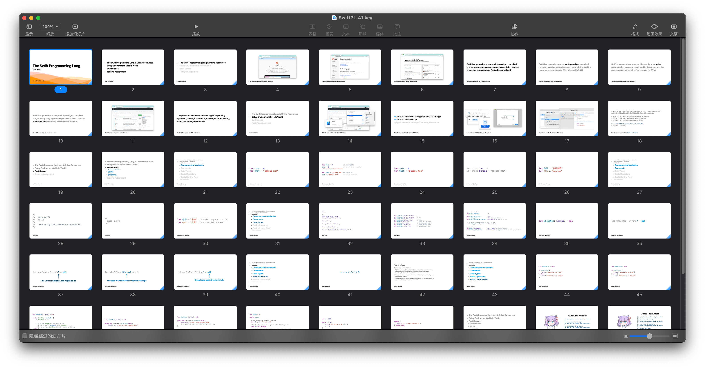

# SwiftCourse

A repository to store PPTs for my students learning Swift.

## Table of Contents

###  The Swift Programming Lang - First Step

[Keynote - 2022.09.19](./Keynotes/SwiftPL-A1.pdf)

Video are recorded as Chinese. Contact me if you want it.

- The Swift Programming Lang & Online Resources
- Setup Environment & Hello World
- Swift Basics
    - Constants and Variables
    - Comments
    - Data Types
    - Basic Operators
    - Basic Control Flow
- Today’s Assignment (Guess Number)

---

Copyright © 2022 Lakr Aream. All Rights Reserved.

